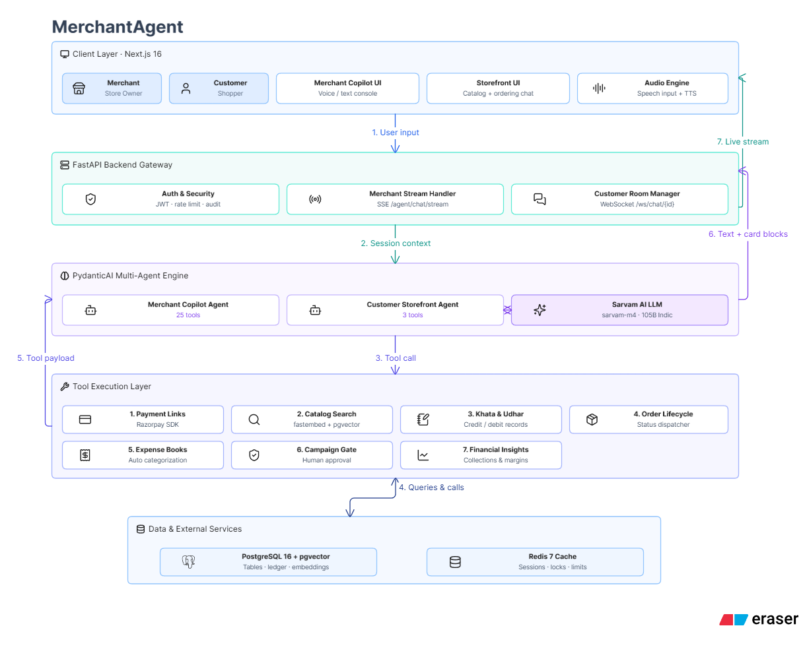

# MerchantAgent - Why This, Why Now

*Built for Track 1 (AI Growth & Agentic Commerce), Razorpay Buildathon.*

--- 

## 1. The Problem

Roughly 60 million small merchants in India run their business on WhatsApp and memory. Not Shopify. Not Tally. Not QuickBooks. A notebook under the counter, a phone full of customer numbers, and a lot of mental math.

Here's what that actually looks like on an ordinary Tuesday:

A regular customer, Rahul, wants to pay ₹500 for his weekly order. The shopkeeper opens the Razorpay dashboard, fills in a form, copies a link, pastes it into WhatsApp. Five minutes gone, for one transaction.

Diwali is coming, and the shop wants to offer its twenty most loyal customers a discount. That means opening WhatsApp, finding each contact, typing the same message twenty times with small changes, and hoping nobody gets missed or double-messaged.

Someone asks if there's still milk in stock. The answer means walking to the shelf and counting.

And at the end of the day, the question "how much did I actually make today" gets answered by flipping through a paper ledger, if it gets answered with any confidence at all.

None of this is a technology failure exactly. It's that the technology built for merchants assumes they're already running on a modern stack. Razorpay's own Agent Studio, the Dispute Responder, the Subscription Recovery agent, the Abandoned Cart flow, all of it plugs into merchants who are already on Shopify or Tally or QuickBooks. That's a real, valuable product. It just doesn't reach the merchant with a notebook.

On the other side of the counter, the customer has their own version of the same problem. They want to know if a shop has what they need before walking over, they want a simple way to pay without an app download or a phone call, and they have zero visibility into whether their last order actually shipped or what they still owe.

That's the actual gap. Not "merchants need an app." Merchants need someone to take the five-minute tasks and the paper ledger off their plate, in the language they already speak, without asking them to become a different kind of business overnight.

---

## 2. The Idea, In One Line

One AI agent a merchant talks to like a person, handling payments, orders, campaigns, and stock, in English, Hindi, or Hinglish, with every action logged and every money-moving step gated behind the merchant's own approval. And on the other side, a matching agent a customer can talk to, to browse a shop's catalog and check out for real, no app required.

---

## 3. What The Merchant Gets

**A single chat that replaces a dozen separate habits.**

- Say "send Rahul a ₹500 link" and a real Razorpay payment link gets created and handed back, ready to forward.
- Say "run a Diwali offer for my last 20 customers" and the agent pulls the actual list, drafts a personalized campaign, and stops. It cannot send anything on its own. A card appears with Approve and Decline buttons, and only a tap from the merchant releases it.
- Ask "how much did I make this month" and get a real number pulled from actual payment records, not a guess.
- Log an expense, check what's low on the shelf, or ask what happened in the shop this week, all in the same conversation.
- Speak instead of type. The merchant can talk into the chat in Hindi or English and hear the answer read back in one of eight Indian voices.

Every single one of these actions writes an entry to an audit log the merchant can ask about directly: "what did you do for me today?" There's no hidden layer. If the agent creates a payment link, records an expense, or drafts a campaign, that action exists somewhere the merchant can see it, with a timestamp and a reason attached.

And the boring but important part: money never moves twice by accident. If the agent gets asked to create a payment link and, for whatever reason, tries to do it again in the same turn, it recognizes the duplicate and returns the original instead of creating a second one. Small detail, and exactly the kind of thing that matters once real people are actually using it.

---

## 4. What The Customer Gets

**A way to find and buy from a local shop without ever downloading anything shop-specific.**

- Browse a directory of nearby stores by category or search by name.
- Open a shop's own chat and ask it directly: "do you have milk," "what's the price of rice," "can I get two packets delivered." The shop's own AI answers from its real catalog, not a guess.
- Get a real Razorpay checkout link the moment an order is confirmed, and pay right there.
- See every order placed, every receipt, and every payment status in one place, across every shop used, not scattered across separate WhatsApp threads.

If the shop owner is around, they can jump into the same conversation and answer directly. If they're not, the store's own agent handles it. Same thread, same customer, no gap in the experience either way.

---

## 5. Architecture
 

The whole thing runs on one database, doing double duty as both the regular relational store and the vector store for semantic catalog search. No separate vector database, no second service to keep alive. The merchant-facing chat streams over Server-Sent Events, since that's a one-way flow and doesn't need anything heavier. The customer-facing chat runs over a WebSocket, because a customer, the shop owner, and the agent might all be in the same thread at once, and that needs a two-way channel. Two different jobs, two different tools, not one hammer used everywhere.

---

## 6. Why This Actually Works In The Market

**It doesn't compete with Razorpay's own Agent Studio. It reaches past it.**

Agent Studio is built for merchants already running on Shopify, Tally, or QuickBooks, which means it's built for maybe the top slice of Indian merchants by digital maturity. MerchantAgent is built for everyone underneath that line, the much larger group still running on WhatsApp groups and a notebook. That's not a smaller market. It's the bigger one, just harder to reach with a traditional integration-first product.

**The language choice isn't a feature, it's the whole unlock.** A kirana store owner who's comfortable typing in Hinglish, or would rather just talk out loud in Hindi, was never going to adopt an English-only dashboard no matter how good the automation underneath it was. Meeting merchants in the language and format they already use, plain conversation, is what makes adoption realistic instead of theoretical.

**The approval gate isn't a compliance checkbox, it's trust.** A merchant with a paper ledger and years of doing things by hand isn't going to hand full control of their money to a chatbot on day one, and shouldn't have to. Every money-moving action being visible, logged, and gated behind a real approval means the merchant stays in control while still getting the speed of automation. That's the actual bridge between "I don't trust this" and "I use this every day."

**The catalog isn't just a product list, it's a door.** Exposing a merchant's stock in a structured, queryable form means it's not only their own chat that can use it. Any AI shopping agent built by someone else could, in principle, ask a MerchantAgent-powered shop "do you have this in stock" and get a real answer. That's the actual bet behind "agentic commerce": the value isn't only automating one merchant's operations, it's making that merchant reachable by an entire ecosystem of agents that don't exist yet but are clearly coming.

None of this needed KYC, a live bank account, or real money moving to prove out. Test mode was enough to show the whole loop end to end, catalog to chat to payment to receipt, which is exactly what a hackathon needs to demonstrate and exactly what a real merchant would want to see working before trusting it with anything real.
